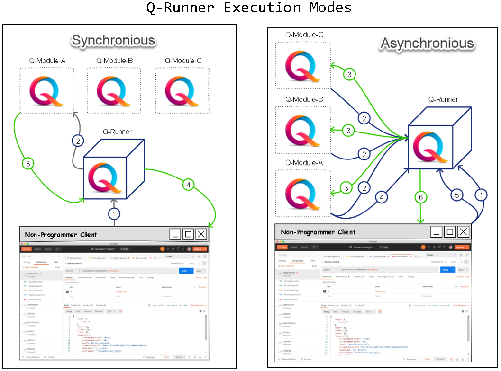

# Q-Runner

_Simplify interaction with your java business logic by making it REST accessible._

***

**Breif History**  
A project I was working on, required that our java infrastructural modules were tested by an external QA team of non-programmers. Q-Runner is a bridge between my team and the QA team allowing them to run our java code using REST commands.

**Features**

1. Simple and configurale interaction with business-logic. For example, you can easily configure the class _EntityCache_ to become available for remote execution under the _entity_cache_ identifier and the class TokenGenerator under _token_generator_
   identifier like so:

```yaml
instanceToModule:
  - instanceId: entity_cache
    qModule: qa.EntityCache
  - instanceId: token_generator
    qModule: qa.TokenGenerator
```

2. Supports both **request-response** and **asynchronious** execution methods. When commands are sent directly to a Q-Runner runnin instance, it executes the required logic and returns a result to the client. You may, however, configure Q-Runner to _
   pull_ requests from a designated address (**commandAggregator**) and to publish their results to the same or a different address (**outputAggregator**) in which case the client publishes requests to the commandAggregator which stores the requests
   and replies with an immediate _200-OK_ while all running Q-Runner instances poll the command-aggregater every pre-defined time amount, execute fetched request if applicable to the specific instance and publish the result so that the client may _
   pull_ these (and other) retults at its own convenience.

```yaml
commandAggregatorAddress: http://localhost:2104
outputAggregatorAddress: http://localhost:2104
autoPullingCommands: false
autoPullingIntervalSeconds: 1
```



3. Many built-in convenience requests to ease interaction with the java-logic, for example:
* `createObject`- to generate a selected java-object and store it in memory
* `viewMemory`- to view a json-representation of an object stored in memory
* `editObject`- to manipulate the fields of an object stored in memory

4. A browser accessible end-point to review and filter through all available requests and their parameters.

5. Simple and extensible (with no need in recompilation):

```
run.bat
│
├───config
│       config.yaml
│       server.yaml
│  
│
├───jars
│   ├───osf_modules
│   │       configuration.module-0.0.5.jar
│   │       context-provider-module-0.0.11.jar
│   │       ctlm.module-0.0.8.jar
│   │       elm-module-0.0.35.jar
│   │       notifications-0.0.12.jar
│   │       osf-0.0.16.jar
│   │       osf-object-0.0.5.jar
│   │       shared-0.0.13.jar
│   │       synchronization-module-0.0.11.jar
│   │       TestEntities-0.0.35.jar
│   │
│   ├───qa_modules
│   │       QAELM-1.0-SNAPSHOT.jar
│   │
│   ├───simulator
│   │       QRunner-1.0-SNAPSHOT.jar
│   │
│   └───third_party
│           aether-api-1.0.2.v20150114.jar
│           aether-connector-basic-1.0.2.v20150114.jar
│           aether-impl-1.0.2.v20150114.jar
│           aether-spi-1.0.2.v20150114.jar
│           aether-transport-file-1.0.2.v20150114.jar
│           ...
│            
└───logs
        QALog-2021-01-01.log.gz
        QALog-2021-01-02.log.gz
        QALog-2021-01-03.log.gz
        QALog-2021-01-04.log.gz
        QALog.log
```

## Configurations Example

```yaml
applicationId: "MyApplication"
server:
  applicationConnectors:
    - type: http
      port: 2104
  adminConnectors:
    - type: http
      port: 2105
commandAggregatorAddress: http://localhost:2104
outputAggregatorAddress: http://localhost:2104
autoPullingCommands: false
autoPullingIntervalSeconds: 1
activeObjectFactories:
  - qa.components.factories.BasicObjectFactory
  - qa.components.factories.OSFObjectFactory
activeModuleLoaders:
  - qa.components.providers.MockModuleProvider
  - qa.components.providers.OSFModuleProvider
instanceToModule:
  - instanceId: entity_cache
    qModule: qa.EntityCache
  - instanceId: token_generator
    qModule: qa.TokenGenerator
# Logging settings.
logging:
  level: INFO
  appenders:
    - type: console
  target: stderr
            - type: file
  currentLogFilename: ./logs/QALog.log
  archivedLogFilenamePattern: ./logs/QALog-%d.log.gz
  archivedFileCount: 5
  # Logger-specific levels.
  loggers:
    "qa.App":
    level: DEBUG
```
